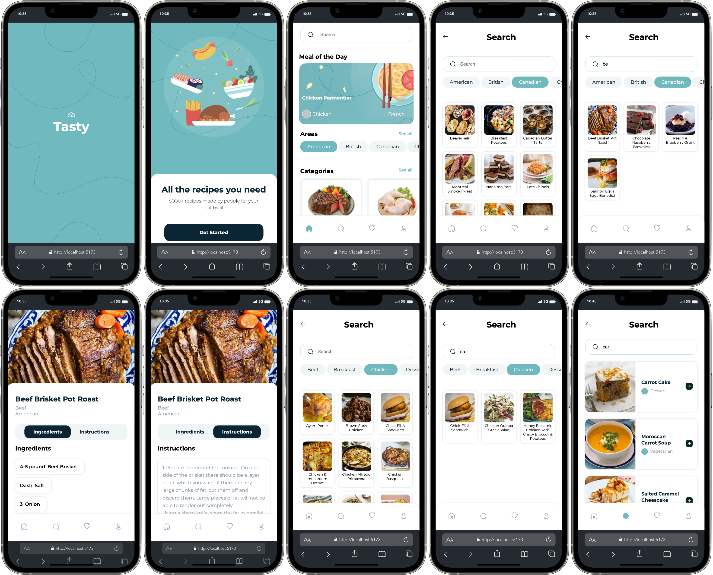

# Collaborative project: Tasty Recipe App

## Contributors

- [MiaMarmeladenbrot](https://github.com/MiaMarmeladenbrot)
- [Reazy96](https://github.com/Reazy96)
- [Hkndevit](https://github.com/Hkndevit)
- [thomaserdmenger](https://github.com/thomaserdmenger)

## Purpose of the website

- Create a recipe app
- User can search recipes by country and category
- User can search for recipes by name
- User receives detailed page of the recipe with ingredients, quantities and instructions
- User receives random recipe suggestions

## Built with

- Mobile Design
- Grid and Flexbox Layout
- React
- React Router DOM

## Links

- [See live site here](https://tasty-react-sigma.vercel.app/)
- [GitHub Repository](https://github.com/thomaserdmenger/Tasty-React)
- [GitHub Author](https://github.com/thomaserdmenger)
- [LinkedIn Author](https://www.linkedin.com/in/thomaserdmenger/)

## Screenshot-Image

